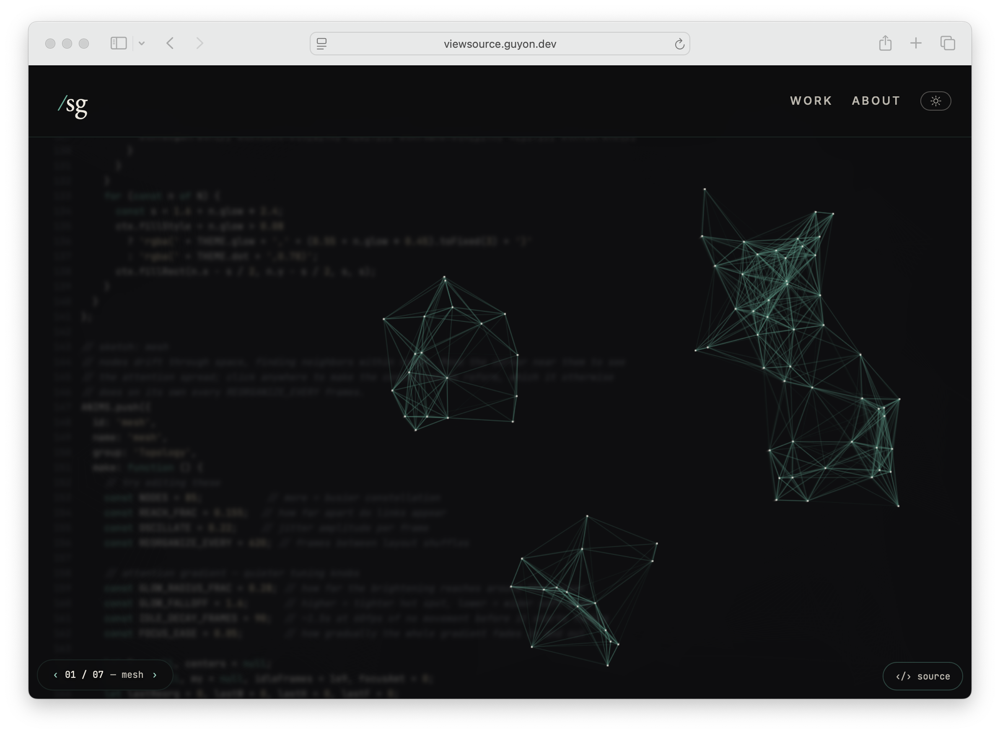

# View Source

<p align="center">
  <a href="https://viewsource.guyon.dev"></a>
</p>

A personal site that shows its own source and lets you edit it live.

Live: [viewsource.guyon.dev](https://viewsource.guyon.dev)

Inspiration: [mrdoob/htmleditor](https://github.com/mrdoob/htmleditor) (2012!).

`index.html` is the page. The sketches live in it. `machine.js` fetches that HTML, draws it over the site, and opens a CodeMirror editor on `/`. Without `machine.js` you just get a normal page.

This repo is the playground: the HTML pages, the machine, the stylesheet, and the vendored editor. It is not the deploy, the analytics backend, or the optional AI-edit service on the live site.

### Flow

On load, `machine.js` fetches `index.html` and keeps that text. Everything below
uses it. The left branch is that HTML drawn over the site, faded so the real
page still shows through.

```
      ┌────────────────────┐
      │     index.html     │
      └─────────┬──────────┘
                │  fetch
                v
      ┌────────────────────┐
      │    source text     │
      └──┬───────────────┬─┘
         │               │
         v               v
  ┌────────────┐  ┌────────────┐
  │ HTML over  │  │ CodeMirror │
  │  the page  │  └──────┬─────┘
  │  (faded)   │         │  type
  └────────────┘         v
                  ┌────────────┐
                  │   iframe   │
                  └──────┬─────┘
                         │  reset / reload
                         v
                  ┌────────────┐
                  │ real page  │
                  │ unchanged  │
                  └────────────┘
```

Cmd/Ctrl+S downloads the current HTML.

### Architecture

Top of each stack is closest to you (the browser). Bottom is the back of the
screen. The iframe is a full-screen layer you look through, not a hidden
document. The real page stays at the back, hidden, until you reset.

```
  Reading                      After you type

  ┌────────────────┐           ┌────────────────┐
  │    viewport    │           │    viewport    │
  └────────┬───────┘           └────────┬───────┘
           v                            v
  ┌────────────────┐           ┌────────────────┐
  │ HTML over page │           │ CodeMirror     │
  │ (see-through)  │           │ (see-through)  │
  ├────────────────┤           ├────────────────┤
  │ real page      │           │ iframe         │
  └────────────────┘           ├────────────────┤
                               │ real page      │
                               │ (hidden)       │
                               └────────────────┘
```

Clicks pass through the faded HTML. CodeMirror loads the first time you open
the editor. Escape closes it.

The editor opens on the whole document, scrolled to the running animation. After
a short pause the rest of the file folds away. Use **sketch** / **whole page**
to switch.

## Run it

Must be served over HTTP — `machine.js` `fetch()`es the current page, which fails on `file://`.

```sh
python3 -m http.server 8010
```

Open http://localhost:8010 — click `‹/› source` or press `/`.

## Layout

```
index.html              home — sketches are inline in this file
about.html
work.html
machine.js              source view + editor
site.css
vendor/codemirror.js    CodeMirror 6 HTML bundle (the one built artifact)
tools/build-vendor/     optional rebuild of that bundle
```

## Rebuild the CodeMirror bundle

Rarely needed. The committed `vendor/codemirror.js` is enough to run.

```sh
cd tools/build-vendor && npm install && npm run build
```

## License

MIT. CodeMirror 6 is also MIT; the vendored bundle is their code, minified.
